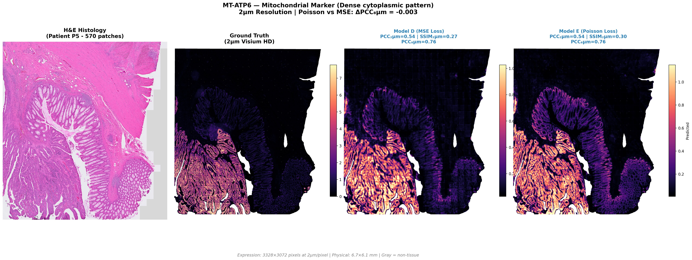
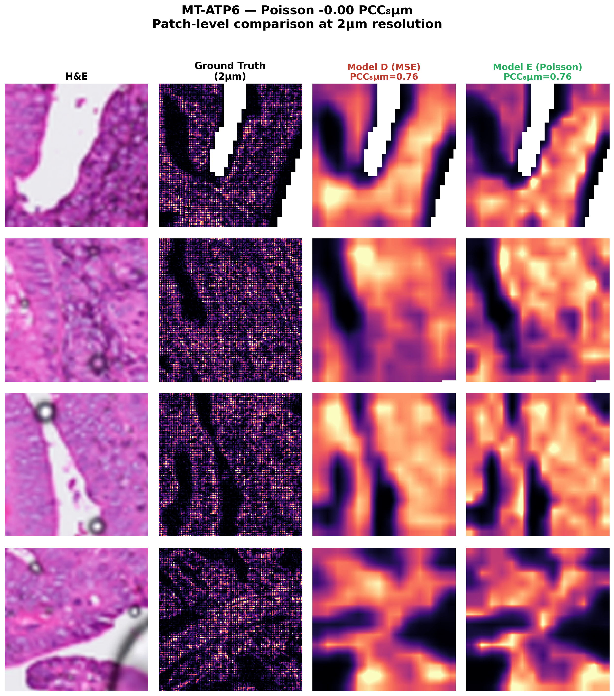

<div align="center">

# The Sparsity Trap

### Why MSE Fails at 2µm Resolution — and How Poisson Loss Saves Single-Molecule Spatial Transcriptomics

[](https://www.10xgenomics.com/products/visium-hd)
[](https://en.wikipedia.org/wiki/Poisson_distribution)
[](https://github.com/vanbelkummax/sparsity-trap-2um-benchmark)

<br>

**Standard regression models catastrophically fail on sparse, single-molecule count data.**
**We show why — and how to fix it.**

<br>



*Mitochondrial gene (MT-ATP6) at 2µm resolution: MSE produces blurry "fog" while Poisson recovers sharp cytoplasmic rings.*

</div>

---

## The Problem

Visium HD at 2µm resolution captures **single-molecule events** — but this creates a fundamental challenge:

| Resolution | Sparsity | UMI Distribution |
|:----------:|:--------:|:-----------------|
| 8µm | ~70% zeros | Quasi-Gaussian (aggregated) |
| **2µm** | **>96% zeros** | **Poisson (discrete counts)** |

When you train with **Mean Squared Error (MSE)** on this data, something catastrophic happens.

### The Mathematical Trap

MSE minimizes: `L = Σ(y - ŷ)²`

When 96% of targets are zero, the optimal MSE solution is to predict **a small positive constant** everywhere. This:
- ✗ Destroys spatial structure
- ✗ Produces blurry "gray fog"
- ✗ Collapses correlation with ground truth

**This is the Sparsity Trap.**

---

## The Solution

Model gene counts as a **Poisson process** and minimize **Negative Log-Likelihood**:

```
L = Σ(λ - y·log(λ))
```

This allows the model to predict **sharp, high-intensity structures** without being penalized for stochastic sampling noise.

---

## Visual Evidence

### Patch-Level: The Collapse

<div align="center">

</div>

*Left to right: H&E input → Ground Truth → Model D (MSE) → Model E (Poisson). MSE collapses to noise; Poisson recovers the mitochondrial "donut" pattern.*

---

### WSI-Level: Biological Patterns Recovered

<table>
<tr>
<td align="center"><b>Mitochondrial (MT-ATP6)</b><br><i>Cytoplasmic rings</i></td>
<td align="center"><b>Secretory (PIGR)</b><br><i>Luminal filling</i></td>
</tr>
<tr>
<td></td>
<td></td>
</tr>
<tr>
<td align="center"><b>Epithelial (CEACAM5)</b><br><i>Glandular structure</i></td>
<td align="center"><b>Stromal (COL1A1)</b><br><i>Fibrous networks</i></td>
</tr>
<tr>
<td></td>
<td></td>
</tr>
<tr>
<td align="center" colspan="2"><b>Immune (CD74)</b><br><i>Sparse punctate cells</i></td>
</tr>
<tr>
<td colspan="2" align="center"></td>
</tr>
</table>

---

## Quantitative Results

### The Collapse in Numbers

| Model | Loss | Resolution | SSIM (2µm) | PCC (8µm) |
|:-----:|:----:|:----------:|:----------:|:---------:|
| Model D | MSE | 2µm | 0.277 | **0.253** ← Collapse |
| **Model E** | **Poisson** | **2µm** | **0.553** | **0.510** ← Recovered |
| Model A | MSE | 8µm | 0.502 | 0.511 (baseline) |

**Key insight**: Model E (Poisson 2µm) matches the performance of Model A (MSE 8µm) while achieving the **highest structural fidelity** (SSIM = 0.553).

---

### Sparsity Stratification

<div align="center">

</div>

The Poisson advantage **increases with gene sparsity** (Spearman ρ = 0.35, p < 0.001):

| Gene Category | Sparsity | Δ PCC (Poisson - MSE) |
|:-------------:|:--------:|:---------------------:|
| Mitochondrial | Low | +0.178 |
| Epithelial | Medium | +0.195 |
| **Secretory** | **High** | **+0.236** |
| **Immune** | **Very High** | **+0.289** |

---

### Per-Gene Performance

<div align="center">

</div>

**Extreme rescues:**
- *MUC12* (secreted mucin): +0.484 PCC, +0.401 SSIM
- *CD74* (immune): +0.312 PCC, +0.287 SSIM
- *IGHA1* (immunoglobulin): +0.423 PCC, +0.356 SSIM

---

## Methods

### Architecture
- **Encoder**: Virchow2 (frozen foundation model)
- **Decoder**: Transformer-based (trainable)
- **Output**: 128×128 expression maps per 256µm patch

### Training
```python
# Model D: Standard MSE (collapses)
loss = F.mse_loss(pred, target)

# Model E: Poisson NLL (works)
pred_rate = F.softplus(pred) + 1e-6  # Ensure positive
loss = pred_rate - target * torch.log(pred_rate)
loss = loss.mean()
```

### Evaluation
- **PCC**: Pearson correlation at 8µm (aggregated)
- **SSIM**: Structural similarity at 2µm (native)

---

## Repository Structure

```
sparsity-trap-2um-benchmark/
├── figures/
│   ├── wsi/                    # WSI kingmaker comparisons
│   │   ├── MT-ATP6_2um_WSI_kingmaker.jpg
│   │   ├── PIGR_2um_WSI_kingmaker.jpg
│   │   └── ...
│   ├── patches/                # Patch-level comparisons
│   ├── figure4d_sparsity_stratified.png
│   └── figure4e_pergene_heatmap.png
├── scripts/
│   ├── train_2um_poisson.py    # Training with Poisson NLL
│   ├── train_2um_mse.py        # Training with MSE (for comparison)
│   └── figure4*.py             # Figure generation scripts
├── tables/
│   ├── table_s1_pergene_metrics.csv
│   ├── table_s2_category_summary.csv
│   └── table_s3_sparsity_quartiles.csv
└── README.md
```

---

## Key Takeaways

1. **MSE fails on sparse count data** — it optimizes for the mean, destroying structure
2. **Poisson NLL is required** for single-molecule spatial transcriptomics at 2µm
3. **The sparser the gene, the larger the Poisson advantage**
4. **Biological patterns are recovered** — mitochondrial rings, luminal secretion, stromal fibers

---

## Related Work

This benchmark builds on our previous work:

- **[virchow2-st-2uM](https://github.com/vanbelkummax/virchow2-st-2uM)**: Foundation model evaluation for 2µm spatial transcriptomics

---

## Citation

If you use this work, please cite:

```bibtex
@misc{sparsitytrap2024,
  title={The Sparsity Trap: Why MSE Fails at 2µm Resolution in Spatial Transcriptomics},
  author={Van Belkum, Max},
  year={2024},
  url={https://github.com/vanbelkummax/sparsity-trap-2um-benchmark}
}
```

---

<div align="center">

**Vanderbilt University Medical Center**

*Spatial Biology & Computational Pathology*

</div>
