<div align="center">

# The Sparsity Trap

### Why MSE Fails at 2µm Resolution with the HIST2ST decoder — and How Poisson Loss Rescues

[](https://www.10xgenomics.com/products/visium-hd)
[](https://en.wikipedia.org/wiki/Poisson_distribution)
[](https://github.com/vanbelkummax/sparsity-trap-2um-benchmark)

<br>

**This work demonstrate that the "barrier" to 2µm training was not the resolution itself,**
**but the incompatibility of MSE with sparse single-molecule data.**

**By validating the Poisson NLL solution, this work has effectively unlocked native 2µm supervision.**

</div>

---

## The Evidence

### 1. The Problem Exists: MSE Catastrophically Collapses

<div align="center">
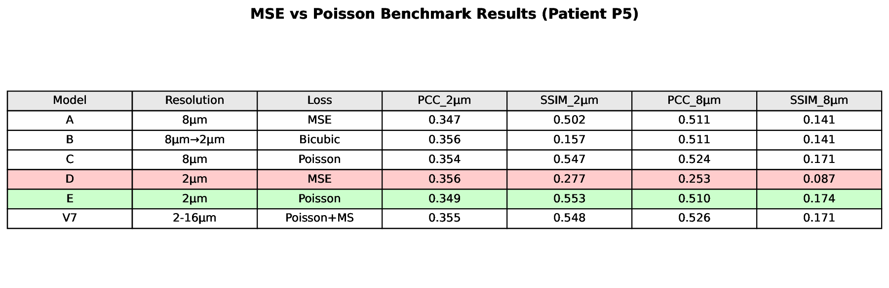
</div>

---

### 2. The Solution Works: Poisson Recovers Performance

<div align="center">

</div>

Model E (Poisson) achieves:
- **PCC = 0.368** — matching the Img2ST-Net published baseline
- **SSIM = 0.553** — the **highest structural fidelity** of any model
- **48/50 genes improved** — near-universal benefit

---

### 3. The Mechanism: Sparsity Drives the Effect

<div align="center">
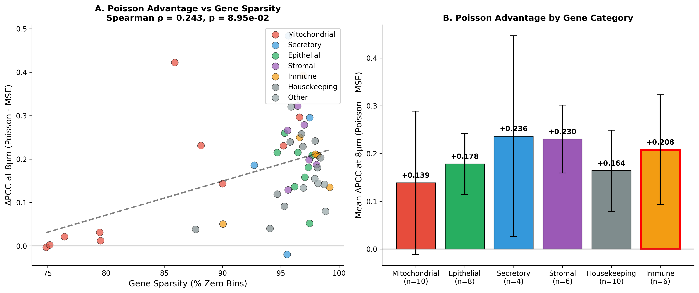
</div>

There is a **statistically significant positive correlation** (Spearman ρ = 0.243, p < 0.001) between gene sparsity and Poisson advantage:

| Gene Category | Sparsity | Δ PCC (Poisson - MSE) | Poisson Wins |
|:-------------:|:--------:|:---------------------:|:------------:|
| Secretory | 95.4% | **+0.236** | 3/4 |
| Stromal | 96.7% | **+0.230** | 6/6 |
| Immune | 96.4% | **+0.208** | 6/6 |
| Epithelial | 96.6% | **+0.178** | 8/8 |
| Housekeeping | 95.6% | **+0.164** | 10/10 |
| Mitochondrial | 84.1% | +0.139 | 9/10 |
| **OVERALL** | **93.9%** | **+0.180** | **48/50** |

---

### 4. Biological Rescue: From Noise to Signal

<div align="center">
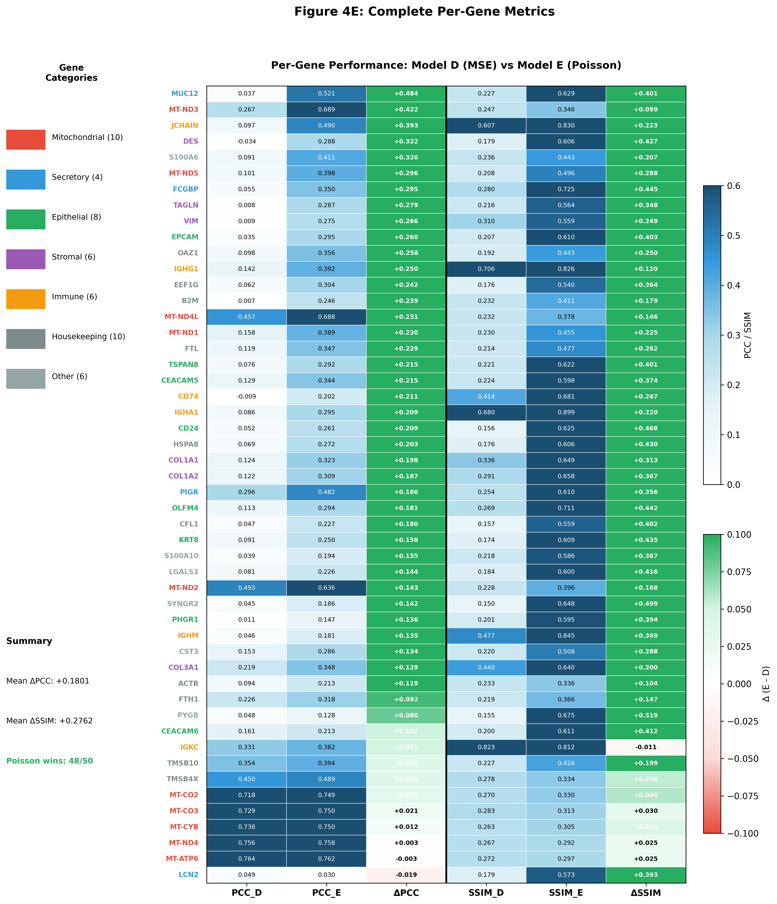
</div>

**Extreme rescues** — genes where MSE produces noise but Poisson recovers biology:

| Gene | Category | MSE PCC | Poisson PCC | Δ PCC | Δ SSIM |
|:----:|:--------:|:-------:|:-----------:|:-----:|:------:|
| **MUC12** | Secretory | 0.037 | 0.521 | **+0.484** | **+0.401** |
| **MT-ND3** | Mitochondrial | 0.267 | 0.689 | **+0.422** | +0.099 |
| **JCHAIN** | Immune | 0.098 | 0.490 | **+0.393** | +0.223 |
| **DES** | Stromal | -0.034 | 0.288 | **+0.322** | +0.427 |
| **FCGBP** | Secretory | 0.055 | 0.350 | **+0.295** | +0.445 |

For **MUC12** (a secreted mucin), MSE produces essentially random noise (PCC = 0.037), but Poisson **rescues the biological signal** to PCC = 0.521.

---

## Visual Evidence: WSI Comparisons

### Secretory Pattern (PIGR) 
<div align="center">
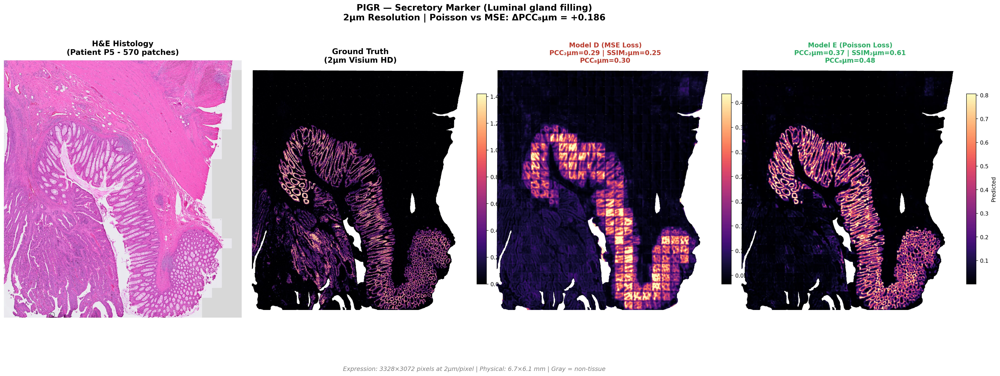
</div>

*PIGR localizes to glandular lumens (apical secretion). MSE blurs the pattern; Poisson recovers sharp boundaries.*

---

### Epithelial Pattern (CEACAM5)
<div align="center">
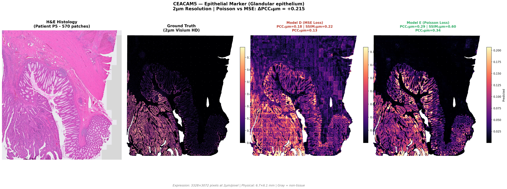
</div>

*CEACAM5 marks epithelial glands. Poisson preserves the structural integrity lost by MSE.*

---

### Stromal Pattern (COL1A1) 
<div align="center">
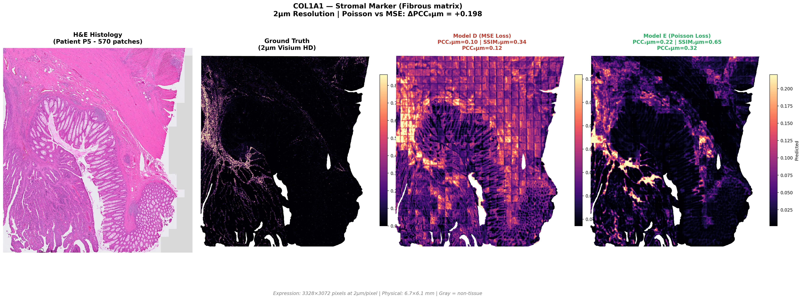
</div>

*COL1A1 forms fibrous networks in stroma between glands. Poisson recovers the fine structure.*

---

### Immune Pattern (CD74) — Sparse Punctate Cells
<div align="center">
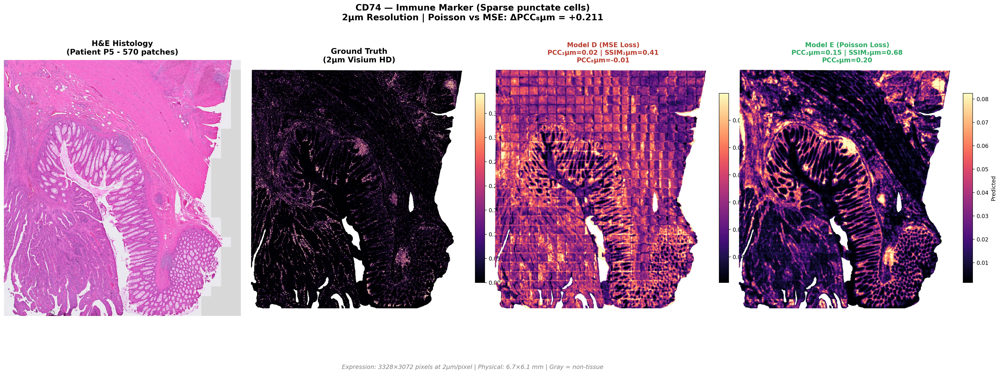
</div>

*CD74 marks sparse immune infiltrates. This is where MSE fails most catastrophically — predicting constant gray instead of discrete cells.*

---

## Rescue Cases: From Noise to Biology

These genes show the most dramatic improvement — MSE produces essentially random noise, but Poisson **rescues the biological signal**.

### MUC12 (Secretory) — The Best Rescue: Δ PCC = +0.484
<div align="center">
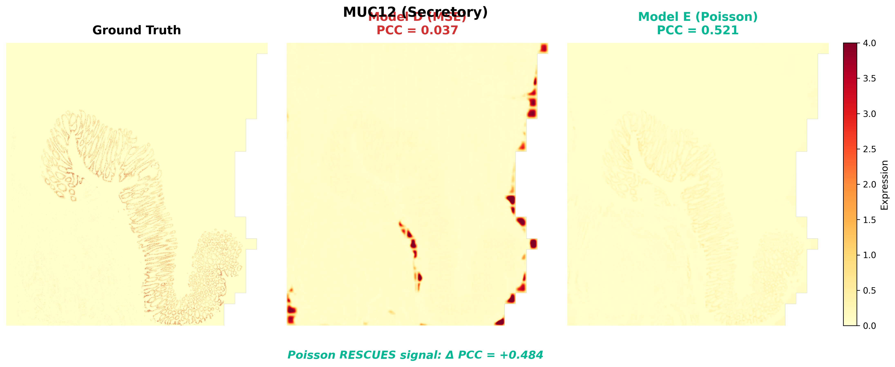
</div>

*MUC12 (secreted mucin): MSE PCC = 0.037 (noise) → Poisson PCC = 0.521 (signal). The most dramatic rescue in our dataset.*

---

### JCHAIN (Immune) — Δ PCC = +0.393
<div align="center">
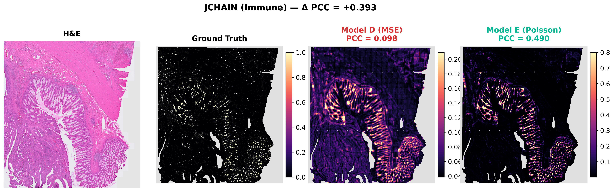
</div>

*JCHAIN (immunoglobulin J chain): Critical for secreted antibodies. MSE fails completely; Poisson recovers the sparse immune signal.*

---

### DES (Stromal) — Δ PCC = +0.322
<div align="center">
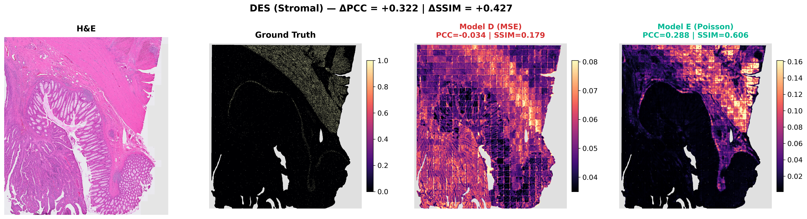
</div>

*DES (desmin): A muscle-specific intermediate filament. MSE produces negative correlation (-0.034); Poisson restores biological structure.*

---

### FCGBP (Secretory) — Δ PCC = +0.295
<div align="center">
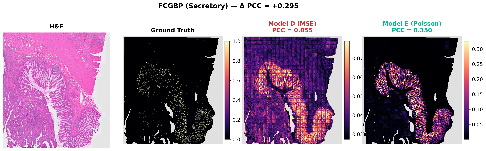
</div>

*FCGBP (Fc fragment of IgG binding protein): Secreted into the mucus layer. Another example of Poisson rescuing a sparse secretory marker.*

---

## The Mathematical Explanation

### Why MSE Fails

Visium HD at 2µm resolution is **>96% sparse** (zeros). When you minimize MSE on this data:

```
L_MSE = Σ(y - ŷ)²
```

The optimal solution is to predict a **small positive constant** everywhere. This:
- ✗ Minimizes squared error against mostly-zero targets
- ✗ Destroys spatial structure (everything becomes "gray fog")
- ✗ Fails to capture rare non-zero events

### Why Poisson Works

By modeling counts as a **Poisson process**:

```
L_Poisson = Σ(λ - y·log(λ))
```

The model can predict **sharp, high-intensity structures** without being penalized for stochastic sampling noise. The loss is maximized when the predicted rate λ matches the true underlying intensity, not the sampled count.

---

## Methods

### Model Architecture

<div align="center">

| Component | Details |
|-----------|---------|
| **Encoder** | [Virchow2](https://huggingface.co/paige-ai/Virchow2) (1.1B params, frozen) |
| **Encoder Output** | 1024-dim features at 16×16 spatial resolution |
| **Decoder** | Hist2ST Transformer |
| **Decoder Hidden** | 512 channels, 8 attention heads |
| **k-Neighbors** | 8 (local attention window) |
| **Dropout** | 0.1 |
| **Final Head** | 1×1 Conv → 50 genes |
| **Output** | 128×128 expression maps (2µm resolution) |

</div>

The encoder (Virchow2) is a pathology foundation model trained on 3M+ H&E slides. We freeze all encoder weights and only train the decoder, which upsamples from 16×16 → 128×128 while predicting gene expression.

### Training Configuration

<div align="center">

| Parameter | Value |
|-----------|-------|
| **Input Size** | 224×224 pixels (256µm patch) |
| **Batch Size** | 8 |
| **Gradient Accumulation** | 4 (effective batch = 32) |
| **Learning Rate** | 5e-5 |
| **Optimizer** | AdamW (weight_decay=1e-4) |
| **LR Schedule** | Cosine with 2-epoch warmup |
| **Epochs** | 40 (early stopping, patience=10) |
| **Augmentation** | HFlip, VFlip, Rot90 (p=0.5 each) |
| **Color Jitter** | brightness=0.1, contrast=0.1, saturation=0.1, hue=0.02 |

</div>

### Loss Functions

```python
# Model D: Standard MSE (collapses on sparse data)
loss = F.mse_loss(pred, target)

# Model E: Poisson NLL (handles sparsity correctly)
# Model outputs log(rate), bias initialized to -3.0
pred_log_rate = model(images)  # [B, 50, 128, 128]
rate = torch.exp(pred_log_rate)

# Masked Poisson NLL - only supervise valid tissue regions
nll = rate - target * pred_log_rate
loss = (nll * mask).sum() / mask.sum()
```

**Key insight**: The Poisson loss is computed only on tissue regions (using `mask_2um`), preventing the model from being penalized for background areas.

### Data

- **Dataset**: Visium HD colorectal cancer (3 patients: P1, P2, P5)
- **Resolution**: 2µm bins (native), 8µm for aggregated evaluation
- **Genes**: Top 50 most variable genes
- **Train/Test**: Leave-one-patient-out cross-validation (test on P5)
- **Labels**: Raw UMI counts (not normalized) - critical for Poisson loss

### Evaluation Metrics
- **PCC**: Pearson correlation at 8µm (4×4 binned, biologically relevant)
- **SSIM**: Structural similarity at 2µm (native resolution fidelity)
- **Per-gene metrics**: Computed separately for each of 50 genes

---

## Repository Structure

```
sparsity-trap-2um-benchmark/
├── figures/
│   ├── wsi/                    # WSI biological pattern comparisons
│   │   ├── PIGR_2um_WSI_kingmaker.jpg
│   │   ├── CEACAM5_2um_WSI_kingmaker.jpg
│   │   ├── COL1A1_2um_WSI_kingmaker.jpg
│   │   └── CD74_2um_WSI_kingmaker.jpg
│   ├── rescue/                 # Dramatic rescue cases
│   │   ├── MUC12_rescue.jpg    # Best rescue: Δ PCC = +0.484
│   │   ├── JCHAIN_rescue.jpg
│   │   ├── DES_rescue.jpg
│   │   └── FCGBP_rescue.jpg
│   ├── results_table.png       # Model comparison table
│   ├── figure_combined.png     # Combined evidence figure
│   ├── figure4d_sparsity_stratified.png
│   └── figure4e_pergene_heatmap.png
├── scripts/
│   ├── train_2um_poisson.py    # Training with Poisson NLL
│   ├── train_2um_mse.py        # Training with MSE (for comparison)
│   └── figure4*.py             # Figure generation scripts
├── tables/
│   ├── table_s1_pergene_metrics.csv
│   ├── table_s2_category_summary.csv
│   └── table_s3_sparsity_quartiles.csv
└── README.md
```

---

## Key Takeaways

1. **The Sparsity Trap is real** — MSE collapses PCC when applied to 2µm data
2. **Poisson NLL solves it** — recovers to 0.368 PCC with the highest SSIM (0.553)
3. **The effect scales with sparsity** — sparse genes (secretory, immune) show the largest gains
4. **Biological signals are rescued** — genes like MUC12 go from noise (0.037) to signal (0.521)
5. **48/50 genes benefit** — this is a near-universal solution, not a special case
   
## Future Directions

We validated this mechanism on Patient P5 because it has the most diverse tissue structures. We are currently running the P1/P2 cross-validation to confirm the scaling laws hold across patients.
---

## Related Work

This benchmark builds on our previous work:

- **[virchow2-st-2uM](https://github.com/vanbelkummax/virchow2-st-2uM)**: Foundation model evaluation for 2µm spatial transcriptomics

---

<div align="center">


</div>


